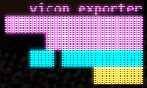

# Vicon Exporter

A small Python tool for processing Vicon Shogun takes (`.mcp`) with Shogun Post CL. It generates HSL scripts, runs Shogun, and writes predictable mocap exports for the local pipeline.

Important: this code requires Vicon Shogun Post with `ShogunPostCL.exe`. Set the executable path in `configuration/settings.py`.

## Features

- Runs Shogun Post CL with live streaming output.
- Generates HSL scripts for each take.
- Exports actor `.fbx`, `.bvh`, `.c3d`, and `.mcp` files.
- Runs mannequin, MetaHuman-adjusted, and Geeno retarget exports.
- Can read aLigner `*.export.yaml` files and export an aligned frame range without overwriting the classic output.
- Finds take folders recursively from a selected root folder.

## Install

Use uv from the repository root:

```powershell
uv sync
```

Then run:

```powershell
uv run main.py
```

If you do not use uv, install the dependencies from `pyproject.toml` into a Python environment and run:

```powershell
python main.py
```

## Main Outputs

The classic exporter writes to:

```text
take/
  exported/
    markers_world.c3d
    clapperboard.c3d
    actors/
      <actor>_.c3d
      <actor>_.fbx
      <actor>_.bvh
      <actor>_.mcp
```

The aLigner-compatible exporter writes to a separate folder:

```text
take/
  aligned_exports/
    actors/
      <actor>_aligned.c3d
      <actor>_aligned.fbx
      <actor>_aligned.bvh
      <actor>_aligned.mcp
    retargeted/
      metahuman/
        <actor>_metahuman_aligned.fbx
      geeno/
        <actor>_geeno_aligned.fbx
    reports/
      aligned_export_summary.yaml
```

Rerunning the aligned exporter overwrites the previous aligned outputs. This keeps the existing `exported/` folder untouched. The `aligner._data/exports/` folder is also left untouched because it belongs to aLigner.

## aLigner Workflow

After the classic export and an aLigner run, each take should contain:

```text
take/
  exported/
  aligner._data/
    <take>.export.yaml
    <take>.state.yaml
```

Use the menu option:

```text
Run Aligned Export + MetaHuman + Geeno
```

That pass reads `aligner._data/<take>.export.yaml`, finds the MOCAP actor entries, and uses the exported local start/end frame values to generate HSL with:

```hsl
playRange <start_frame> <end_frame>;
```

It then exports the pure aligned actor files and runs the aligned mannequin-compatible MetaHuman output and Geeno retargets.

## Retarget Types

There are two mannequin-style retarget modes:

- `mannequin`: uses `models/basic_mannequin.vsr` with `hsl/retarget_general_template.hsl`. This is the simpler path. It selects each Shogun character, loads the VSR, retargets, selects the retargeting hierarchy, and exports FBX.
- `mannequin adjusted`: uses `models/adjusted_mannequin.vsr` with `hsl/retarget_mannequin_template_adjusted_for_metahuman.hsl`. It retargets once, moves forearm `Rz` twist from the forearm to the hand on both arms, runs `solve`, then retargets again. This is intended for the MetaHuman-adjusted setup, but because it touches the solve skeleton it is more fragile in Shogun.

Geeno retargeting uses `models/geeno.vsr` with the general retarget template.

The aligned `metahuman` output intentionally uses the basic mannequin retarget path because it is less invasive and has been the more reliable Shogun CL path. The adjusted MetaHuman template is still available from the separate menu option, but it touches the solve skeleton and may fail with Shogun script errors around `setProperty -onMod`.

## Generated HSL Files

The app writes HSL files into the take folder so they can be inspected and run manually:

```text
take/
  aligned_export_actor_fbx.hsl
  aligned_retarget_metahuman.hsl
  aligned_retarget_geeno.hsl
```

Shogun Post CL does not always surface detailed script context, so these generated files are the best place to inspect exact line numbers after an error.

## Project Layout

```text
vicon_exporter/
  bvh/
  configuration/
  exporter/
  hsl/
  models/
  ui/
  utils/
  wrapper/
  main.py
  pyproject.toml
  uv.lock
```
